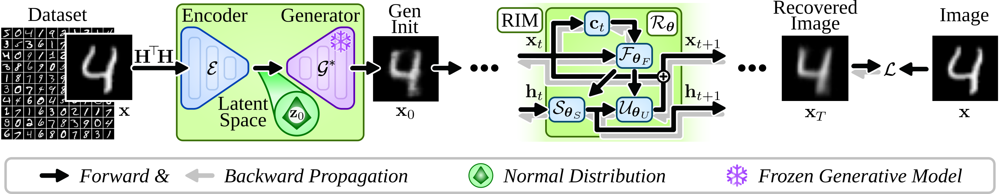
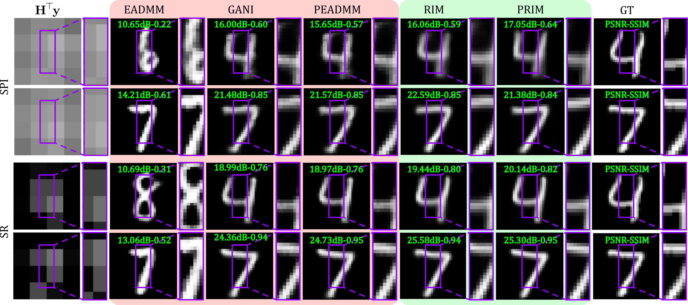

# PRIM: Recurrent Inference Machines with Generative Initialization

<p align="center">
  <strong>Fast learned reconstruction for single-pixel imaging and super-resolution</strong>
</p>

<p align="center">
  
  
  
  
  
</p>

<p align="center">
  <a href="#-overview">Overview</a> &middot;
  <a href="#-method">Method</a> &middot;
  <a href="#-results">Results</a> &middot;
  <a href="#-installation">Installation</a> &middot;
  <a href="#-reproduce-a-complete-condition">Reproduce</a> &middot;
  <a href="docs/INDEX.md">Documentation</a>
</p>

<p align="center">
  
</p>

## 🧭 Overview

PRIM is a reconstruction framework for image inverse problems that couples a **frozen generative prior** with a **Recurrent Inference Machine (RIM)**. A task-specific encoder first maps a backprojected measurement into the latent space of a pretrained WGAN-GP generator. The generated image becomes a structured starting point, and an image-space RIM then improves it through explicit measurement-consistency updates.

This repository provides the complete experimental pipeline used to study PRIM on 32 x 32 MNIST:

- single-pixel imaging (SPI) with row-truncated, zig-zag ordered Hadamard patterns;
- super-resolution (SR) with average filtering and stride-based downsampling;
- GANI, EADMM, PEADMM, and standard RIM comparison methods;
- deterministic data splits, model training, checkpoint evaluation, runtime measurement, and publication figures;
- online or offline Weights & Biases tracking without embedded credentials.

Across the four manuscript conditions, PRIM achieved the highest reported PSNR in every condition and the highest SSIM in three of four conditions.

### Experimental profile

| Component | Setting represented by the code |
|:--|:--|
| Dataset | MNIST, resized to 32 x 32 grayscale |
| Split | 55,000 train / 5,000 validation / 10,000 test |
| Pixel range | `[0, 1]` |
| Default seed | `42` |
| Generative prior | WGAN-GP, latent dimension 128, base channels 64 |
| SPI operator | Row-truncated Hadamard sensing with zig-zag row ordering |
| Supported SPI ratios | `1.0`, `0.1`, `0.05`, `0.01`, `0.005` |
| SR operator | `s x s` average filter followed by stride `s` |
| RIM core | ConvGRU, 32 hidden channels, 10 steps by default |
| Reconstruction metrics | PSNR, SSIM, MSE, and MAE |

## 🧠 Method

For measurements \(y\) produced by a known forward operator \(H\), PRIM initializes the reconstruction as

\[
z_0 = E^*(H^\top y), \qquad x_0 = G^*(z_0),
\]

where \(E^*\) is a pretrained task-specific encoder and \(G^*\) is a pretrained generator. Both remain frozen while the RIM is trained. At recurrent step \(t\), the network receives the current estimate together with the backprojected measurement residual

\[
c_t = H^\top(y - Hx_t),
\]

and predicts the next image update. The training loss supervises the reconstruction trajectory, allowing intermediate steps to contribute to learning.

```text
measurement y
    |
    +--> backprojection H^T y --> encoder E* --> latent z0 --> generator G* --> x0
                                                                            |
    +---------------- data consistency H^T(y - Hx_t) ------------------------+
                                                                            |
                                                                     image-space RIM
                                                                            |
                                                                            v
                                                                  reconstruction x_hat
```

The standard RIM comparison uses the same recurrent image-space architecture but starts from a normalized backprojection. This controls model capacity and isolates the contribution of generative initialization.

### Method families

| Method | Initialization | Iterative refinement | Learned components used at inference |
|:--|:--|:--|:--|
| GANI | `G*(E*(H^T y))` | None | Encoder and generator |
| EADMM | Random latent code | ADMM in latent space | Generator |
| PEADMM | Encoder-predicted latent code | ADMM in latent space | Encoder and generator |
| RIM | Normalized backprojection | Image-space recurrent updates | RIM |
| **PRIM** | `G*(E*(H^T y))` | Image-space recurrent updates | Encoder, generator, and RIM |

## 🧪 Experimental matrix

The public entry points cover the manuscript conditions and additional lower-measurement settings.

| Task | Condition | Forward-model support | Dedicated RIM/PRIM scripts | Reported in the main table |
|:--|:--|:--:|:--:|:--:|
| SPI | compression ratio `0.01` | Yes | Yes | Yes |
| SPI | compression ratio `0.05` | Yes | Yes | Yes |
| SPI | compression ratio `0.005` | Yes | Yes | No |
| SR | scale `x8` | Yes | Yes | Yes |
| SR | scale `x4` | Yes | Yes | Yes |
| SR | scale `x16` | Yes | Yes | No |

The manuscript experiments are noiseless. Training and single-condition evaluation entry points also expose `--measurement-noise-std` for controlled extensions.

## 📊 Results

The values below come from the held-out 10,000-image MNIST test set archived with the experiment summaries. Each cell reports **PSNR in dB / SSIM**; bold values indicate the best result within that condition.

| Method | SPI, ratio 0.01 | SPI, ratio 0.05 | SR x8 | SR x4 |
|:--|--:|--:|--:|--:|
| EADMM | 12.58 / 0.4591 | 21.30 / 0.8607 | 11.58 / 0.3809 | 16.99 / 0.6837 |
| GANI | 17.81 / 0.7410 | 22.54 / 0.9037 | 19.69 / 0.8316 | 24.67 / 0.9395 |
| PEADMM | 17.99 / 0.7466 | 25.23 / 0.9438 | 19.95 / 0.8383 | 25.75 / 0.9525 |
| RIM | 18.29 / 0.7375 | 30.29 / 0.9802 | 20.49 / 0.8497 | 29.24 / **0.9797** |
| **PRIM** | **18.96 / 0.7651** | **30.80 / 0.9839** | **20.91 / 0.8590** | **29.26** / 0.9790 |

The underlying summaries are available as repository data rather than image-only tables:

- [RIM and PRIM metrics](docs/benchmarks/metrics/rim_test_summary.csv)
- [GANI metrics](docs/benchmarks/metrics/gani_test_summary.csv)
- [ADMM metric groups](docs/benchmarks/README.md#contents)
- [runtime measurements](docs/benchmarks/runtime/single_sample_inference_timing.csv)

On an NVIDIA RTX 3090, the archived single-image measurements place PRIM's ten recurrent steps at approximately **6.0-6.7 ms**, depending on the condition. Runtime is hardware- and software-dependent; use the provided benchmark script to measure a new environment.

<p align="center">
  
</p>

## 🚀 Installation

Python 3.10 or newer is required by the source syntax. CPU execution is supported, while a CUDA-capable GPU is strongly recommended for full training and benchmark reproduction.

```bash
git clone <repository-url> PRIM
cd PRIM

python -m venv .venv
source .venv/bin/activate
python -m pip install --upgrade pip
python -m pip install -r requirements.txt
```

On Windows PowerShell, activate the environment with:

```powershell
.venv\Scripts\Activate.ps1
```

`requirements.txt` records the required packages but intentionally does not pin exact versions. For an archival run, capture the resolved environment before training:

```bash
python --version
python -m pip freeze > environment-lock.txt
```

### Weights & Biases

Online runs use the local W&B session or standard environment-based authentication:

```bash
wandb login
```

Choose tracking behavior per command:

```text
--wandb-mode online     Upload metrics, images, tables, and artifacts.
--wandb-mode offline    Keep the run locally without login or network access.
```

The default project is `prim-inverse-problems`. It can be configured without editing source code:

| Variable or flag | Purpose |
|:--|:--|
| `WANDB_API_KEY` | Authentication supplied by the environment or secret manager |
| `WANDB_PROJECT` / `--wandb-project` | Project name override |
| `WANDB_ENTITY` / `--wandb-entity` | Team or account override |
| `WANDB_DIR` / `--wandb-dir` | Local W&B storage directory |

The included [`.env.example`](.env.example) is a variable-name template only; the Python entry points do not automatically load `.env` files. Never commit a populated key file.

## ✅ First verification

Confirm that the SPI implementation passes its shape, adjoint, and full-rate matched-filter checks:

```bash
python -m ops.forward_models --cr 0.1
python -m ops.forward_models --cr 0.01
```

For a short integration run before committing substantial compute, add `--max-train-batches` and `--max-val-batches` to the training commands. These flags are intended for pipeline validation, not reported results.

## ♻️ Reproduce a complete condition

The sequence below reconstructs the dependency chain for **SPI at compression ratio 0.01**. Run commands from the repository root.

### 1. Train the WGAN-GP prior

```bash
python -m train_generator \
  --device cuda \
  --epochs 500 \
  --batch-size 128 \
  --latent-dim 128 \
  --base-channels 64 \
  --activation elu \
  --generator-lr 1e-4 \
  --discriminator-lr 1e-4 \
  --gradient-penalty-weight 10 \
  --critic-iterations 5 \
  --wandb-mode online
```

Expected best checkpoint:

```text
results/generator_wgangp_mnist32_e500_bs128_glr_1e-4_dlr_1e-4_z128_ch64_gp10_crit5_elu/generator.pt
```

### 2. Train the task-specific encoder

```bash
python -m train_encoder_spi0005 \
  --task spi \
  --cr 0.01 \
  --device cuda \
  --epochs 500 \
  --batch-size 128 \
  --generator-checkpoint results/generator_wgangp_mnist32_e500_bs128_glr_1e-4_dlr_1e-4_z128_ch64_gp10_crit5_elu/generator.pt \
  --wandb-group encoder-spi-cr001 \
  --wandb-mode online
```

Expected best checkpoint:

```text
results/encoder_spi_mnist32_cr_1e-2_e500_bs128_lr_1e-3_z128_ch64/encoder.pt
```

### 3. Train PRIM

```bash
python -m train_rim_prop_spi_cr001 \
  --device cuda \
  --epochs 100 \
  --steps 10 \
  --hidden-channels 32 \
  --generator-checkpoint results/generator_wgangp_mnist32_e500_bs128_glr_1e-4_dlr_1e-4_z128_ch64_gp10_crit5_elu/generator.pt \
  --encoder-checkpoint results/encoder_spi_mnist32_cr_1e-2_e500_bs128_lr_1e-3_z128_ch64/encoder.pt \
  --wandb-group prim-spi-cr001 \
  --wandb-mode online
```

For the capacity-matched standard RIM comparison:

```bash
python -m train_rim_nogp_spi_cr001 \
  --device cuda \
  --epochs 300 \
  --steps 10 \
  --hidden-channels 32 \
  --wandb-group rim-spi-cr001 \
  --wandb-mode online
```

### 4. Validate and evaluate checkpoints

The aggregate evaluators encode the expected paths for all manuscript conditions. Check the complete dependency set before inference:

```bash
python -m eval_gani_experiments --check-only
python -m eval_rim_experiments --check-only
```

After every required checkpoint is available, evaluate the learned methods:

```bash
python -m eval_gani_experiments --device cuda
python -m eval_rim_experiments --device cuda
```

The [full reproducibility guide](docs/REPRODUCIBILITY.md) provides commands for both SPI ratios, both SR scales, EADMM/PEADMM sweeps, iteration selection, runtime benchmarks, and rollout figures.

## 🛠 Entry-point reference

### Training

| Entry point | Purpose |
|:--|:--|
| `python -m train_generator` | Train the shared WGAN-GP image prior. |
| `python -m train_encoder_spi0005` | Train an SPI latent initializer; pass the desired ratio explicitly. |
| `python -m train_encoder_sr16` | Train an SR latent initializer; pass the desired scale explicitly. |
| `train_rim_nogp_...` script family | Train a standard backprojection-initialized RIM. |
| `train_rim_prop_...` script family | Train PRIM with the frozen encoder-generator initialization. |

The `<condition>` notation above describes a script family, not a literal module name. Available concrete modules include `spi_cr001`, `spi_cr005`, `spi_cr0005`, `sr_x4`, `sr_x8`, and `sr_x16`.

### Evaluation and analysis

| Entry point | Purpose |
|:--|:--|
| `python -m eval_gani` | Evaluate one encoder-generator baseline condition. |
| `python -m eval_eadmm` | Evaluate one random-initialized EADMM condition. |
| `python -m eval_peadmm` | Evaluate one learned-initialized PEADMM condition. |
| `python -m eval_rim_prop_spi_cr001` | Evaluate one RIM or PRIM checkpoint and its trajectory. |
| `python -m eval_gani_experiments` | Evaluate the four manuscript GANI conditions. |
| `python -m eval_rim_experiments` | Evaluate all manuscript RIM and PRIM conditions. |
| `python -m eval_admm_experiments` | Evaluate selected ADMM configurations. |
| `python -m determine_admm_iterations` | Select ADMM iteration counts from validation trajectories. |
| `python -m time_inference_experiments` | Benchmark synchronized single-sample inference. |
| `python -m visualize_rim_prim_rollouts` | Export step-by-step RIM/PRIM comparisons. |

Every concrete module exposes its authoritative options through `python -m <module> --help`. Reference YAML files under `configs/` document settings and W&B sweeps, but they do not drive every training script directly.

## 📦 Outputs and artifacts

Experiment directories are derived from the active configuration and are created below `results/` by default.

| Artifact | Meaning |
|:--|:--|
| `generator.pt` | Best WGAN-GP generator checkpoint and construction metadata |
| `encoder.pt` / `encoder_last.pt` | Best and final task-specific encoder checkpoints |
| `rim.pt` / `rim_last.pt` | Best-by-validation and final recurrent model checkpoints |
| `*_test_summary.csv` | Aggregate test metrics across experiment conditions |
| `*_iteration_metrics.csv` | Per-step RIM/PRIM trajectory metrics |
| `*_qualitative.png` and SVG outputs | Visual comparisons and editable publication assets |
| local `wandb/` state | Online/offline experiment metadata managed by W&B |

Downloaded data, checkpoints, `results/`, `history/`, local W&B state, caches, and LaTeX build products are excluded from Git. Compact benchmark evidence used by the documentation is preserved under [`docs/benchmarks/`](docs/benchmarks/).

## 🗂 Repository map

```text
.
|-- .github/                    # Issue and pull-request templates
|-- configs/
|   `-- sweeps/                 # Bayesian EADMM/PEADMM W&B sweeps
|-- datasets/                   # MNIST transforms, split, and loaders
|-- docs/
|   |-- benchmarks/             # Curated metrics, runtime, and parameters
|   `-- manuscript/             # LaTeX source and publication figures
|-- models/                     # Generator, encoder, baselines, and RIM
|-- ops/                        # SPI/SR operators, Hadamard tools, and metrics
|-- tools/                      # Release manifest generation and validation
|-- utils/                      # Seeding, observations, visualization, and W&B
|-- train_*.py                  # Training entry points
|-- eval_*.py                   # Evaluation entry points
`-- README.md                   # Project overview and reproduction entry point
```

### Documentation map

| Document | Use it when... |
|:--|:--|
| [Reproducibility guide](docs/REPRODUCIBILITY.md) | Rebuilding the complete experimental workflow |
| [Project map](docs/PROJECT_MAP.md) | Understanding data flow and module ownership |
| [Benchmark archive](docs/benchmarks/README.md) | Auditing reported values and parameter provenance |
| [Documentation index](docs/INDEX.md) | Looking for a specific technical or release document |
| [Release checklist](docs/RELEASE_CHECKLIST.md) | Preparing a tagged public release |
| [Contributing guide](CONTRIBUTING.md) | Proposing a focused code or documentation change |
| [Security policy](SECURITY.md) | Reporting a vulnerability or handling credentials |

## 🔎 Reproducibility checklist

Before comparing or publishing a run:

1. Record the source commit, Python version, resolved dependencies, operating system, and hardware.
2. Confirm the seed, forward operator, task condition, checkpoint paths, and W&B mode.
3. Run the SPI operator verification command.
4. Use validation data for hyperparameter and iteration selection.
5. Evaluate all 10,000 test examples unless the result is explicitly labeled as a subset.
6. Archive aggregate metrics, recurrent-step curves, checkpoint metadata, and runtime settings.
7. Record checksums for every externally distributed checkpoint.

The release manifest can verify all tracked release files except the manifest itself:

```bash
python tools/release_manifest.py --check
```

## ⚠️ Scope and limitations

- The current study is limited to 32 x 32 grayscale MNIST; performance does not imply generalization to natural or high-resolution images.
- The main reported conditions use noiseless measurements, although noise controls are available in several entry points.
- Pretrained checkpoints are not stored in Git, so exact numerical reproduction requires retraining or obtaining matching external artifacts.
- Dependency versions are not pinned in `requirements.txt`; archive the resolved environment for long-term reproduction.
- Condition-specific filenames preserve experiment context and may encode defaults. Explicit CLI arguments and each module's `--help` output are the executable source of truth.
- This is research software, not a production reconstruction service.

## 🧯 Troubleshooting

| Problem | Recommended action |
|:--|:--|
| An evaluator reports missing checkpoints | Run its `--check-only` mode, then train or place each checkpoint at the printed path. |
| CUDA is unavailable | Use `--device cpu` for validation or `--device auto` to let the script select the device. |
| W&B requests authentication | Run `wandb login`, provide `WANDB_API_KEY`, or switch to `--wandb-mode offline`. |
| A full run is too expensive for a first test | Add `--max-train-batches` and `--max-val-batches`; do not report the resulting metrics as full experiments. |
| ADMM evaluation has no parameters | Run the documented W&B sweep and iteration-selection workflow, or supply the archived parameter file format. |
| Results differ across environments | Compare the commit, dependency versions, seed, checkpoint metadata, device, and test-set size. |

## 🤝 Contributing

Focused issues and pull requests are welcome. Read [CONTRIBUTING.md](CONTRIBUTING.md) before proposing changes, keep experimental evidence traceable, and do not commit downloaded data, checkpoints, credentials, local W&B state, or generated archives.

Security-sensitive reports should follow [SECURITY.md](SECURITY.md) rather than a public issue.

## 📚 Citation

If PRIM supports your research, cite the metadata in [CITATION.cff](CITATION.cff). The record can be updated with the final venue, repository URL, or DOI when those identifiers are available.

```bibtex
@software{vasquez_prim_2026,
  title  = {Recurrent Inference Machines with Generative Initialization for Image Inverse Problems},
  author = {Vasquez, Ernesto Jose and Ribero, Juan Jose and Martinez, Emmanuel and Arguello, Henry},
  year   = {2026}
}
```

## 📄 License

No software license is currently declared. Until a license file is added, reuse, modification, and redistribution are not granted by default. Add an appropriate license before the public release so users can clearly understand the permitted uses.
